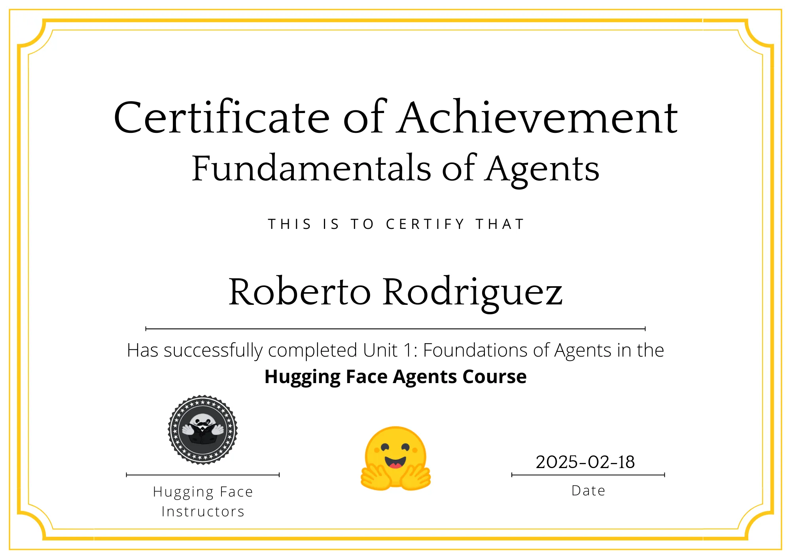

# Unit 1: Introduction to Agents

This unit covers loading and interacting with language models, understanding tokenization, tool execution, and building a tool-calling and ReAct agent from scratch.

## Notebooks Overview

| # | Title | Summary |
| --- | --- | --- |
| 0 | [Introduction to SmolLM2](0-SmolLM2_Introduction.ipynb) | Covers how to load and interact with SmolLM2 efficiently. Explores both direct text prompting and chat-based interactions. |
| 1	| [Tokenization & Next Token Prediction](1-SmolLM2_Tokenization_and_Token_Prediction.ipynb) | Breaks down SmolLM2’s tokenization process. Shows how to predict the next token and interpret model confidence using logits and probabilities. |
| 2	| [Beam Search with GPT-2](2-GPT2_Beam_Search.ipynb) | Explores beam search, a decoding strategy that improves text generation quality by maintaining multiple candidate sequences. |
| 3	| [Chat Templates in SmolLM2](3-SmolLM2_Chat_Templates.ipynb)| Explains how chat templates format conversations for SmolLM2, ensuring structured interactions between users and AI models. |
| 4	| [Defining Tools for SmolLM2](4-SmolLM2_and_Tools.ipynb) | Introduces tool functions that extend AI capabilities (e.g., calling APIs, performing calculations). Demonstrates how to define and register tools. |
| 5	| [Building a Tool-Calling Agent with SmolLM2](5-SmolLM2_ToolCalling_Agent.ipynb) | Implements a fully functional agent that detects when tool calls are needed, executes them, and integrates the results into its responses. |
| 6	| [Creating a Basic ReAct Agent with SmolLM2](6-SmolLM2_ReAct_Agent.ipynb) | Expands on tool-calling agents by introducing ReAct-style reasoning (Thought → Action → Observation). Demonstrates how SmolLM2 can perform multi-step reasoning before making decisions. Shows how to implement structured message accumulation to drive an iterative decision-making loop. |

## Certificate of Completion

